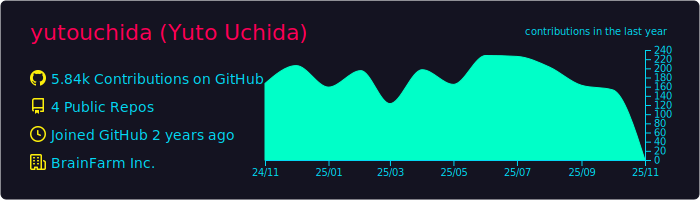
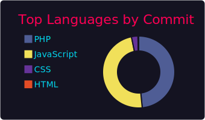

### Hi, there!! This is my Profile!
---

[![Qiita](https://img.shields.io/badge/--FFFFFF?style=social&logo=data:image/vnd.microsoft.icon;base64,iVBORw0KGgoAAAANSUhEUgAAAHgAAAB4CAMAAAAOusbgAAAAGXRFWHRTb2Z0d2FyZQBBZG9iZSBJbWFnZVJlYWR5ccllPAAAADNQTFRFgNRA9PvvquJ/1PC/YMkQddAwv+mfaswgyu2v6vjf3/TPldtgoN5witdQtOaPVcUA////rKcmfAAAABF0Uk5T/////////////////////wAlrZliAAAFI0lEQVR42tSb67qrKAyGw0FAQOn9X+3Udmk9JBAQZ57h7+7iFcjhI2TD6z8a8P8BCzVLAJ22YWGSzj8LHk2wiRgQnXgG7CIJ3eDz2Bvso06sMcyiI9gMqWIE3wcspE6VA9R9cAOWhS6BTRP2gx5vgP2QbowoGsEipnvDqibwveWWFk2D59RjDL4SLKbUZ2hTBR6H1G3ECrDXqeOYBBfsunLfBy14YJN6D4QM/wYXI1/BLqV/gwz97Sooh/jEUACPd7mwRIwR+54sWLD9V8NnnL5Tz995sGlkDsyKV0Pci0rv4oYJ60kC9neOBjPi82QQpxRm+eLhl4xQsB4psC/urxxppTLvp8XPnwCXDtgavmrGZ5A4OBZWW6HXAzGJx8CXjQbgS6jTkJSzYeAB+Tol/+DzYV4lp79fDyBVBfg3D5AhenN4NU92ryNUOAeZybHBWpzBQrPy98tYjt2R4M2+gPzpgGEVeW8bFA+cxiNYXGO0qNS7kZdawxEsCxGOo3d3qU+l0pJXsC6mE0bC3NlgSIVTBnprbH2i3kVjOt18DRvoNJbGeoHw2+1M/DU/sKd/sM5jeWl6Ynzp8APHnP3lon4mNGUs229g/ONsy0VqPWaXOea4gl3e11Evz262e0fVkdZvdgXHQlzNOQdiGlEnHVwufvk/sE154xorL4hhjT2WNgSg57VMhXAZqmhf8AWbwoJflVo7KCUlmNySv+BQOOGGS80AUeWWrD5gS9m8WgSGUdXFgV2G1FS8foMF6UujnMDWL3cvJiXlc0ClsJ8OEA07HaQSOYcYFvDcHPpoJbzcqTLp5/2PQO3GJ2pFSE3jc6XKBlsPRPz/OrGRTqmG+t5ONRF7rShwYAk3hlkTez0DYfG/cBn1PTC+YfINziUmB8kOt7aaCD8keN3lt1KXTcZVOOSJAMP63NNUTT3KRPSogADvVY+qr/uU78oUeF8oqY9cx4tUbAW/asO1FuULHAVWL3aloFRXws2aBfa3FozbCAv8qovY58seCg4scJVdXy70igogtgh+Ta2ulAVDGcwvcSKlMBTsAF/OuZLDJKOPPYpKi5JhIC/BMDCi8oeCBeB+JpEHsEJ6vNaccn68SB/PA+cedDVa081ELvjo6kKd9dAmMFwL5nH21XXN+AFD+QVhf2ROrsMoxahrDqjxAxGL+3WaCFzgAHH6qhvY4UoBiG+S3cABD29AJIF+PUAaj29AqX3x4E4vkwMlBE0nsCTqM0BZ/PQg2GzguVRQ7AsWG/hBux6JlA2kzWvx1JLVDuwfdOUJDcdA67leSz6LCHMAq/ScYR/J9vQKAxwd0kqWEKR6jznoNUBATqD02uz9N8yXlzZIVWm5X1/myFPJDzSExq5kM7HB+HtHI9mUtAQUr0ggGsOVFeyevVh6P+OaLpRNEzgXlcrguUn/3GYB6xnPVoQStzOVYeQ2C5KVWuChxeldWztusyBd77DFbl7hwnXHqD5FKCWxQ9agu5jF1sZw+WDFAxduwnaS6kgflw7zbEUKDKtnj3MH/2ttAmCWZTQwOtgq6g7NpS+iWbA/2TDbI3uTeWdc/3xaOmBX03sru3GJUE/eCnt1owI3gPz8E54xZ0ZHuXxqm0vgl7+5aMlOi1cFc+OkwbOFAKrFW3fZscUeZWQtPl1uaOQUWcba/xwyMOoYwBQWFUE0sGpk7LKSj6xXoFw1tQ28sOe8e9lg+Bq8tpD268g8+U40ddWapgqef6sdOX0lSFiKuA2XjX8EGAA+EkbvnTUZgQAAAABJRU5ErkJggg==&label=Follow%20ucchy4646)](https://qiita.com/ucchy4646)
---

### My SkiLL(Promming languages,FrameWork and Tools)
---
### Languages

### Library・FrameWork

### OS

### Middleware

### Editor・IDE

### Cloud・Other

### Status
---

 
 
